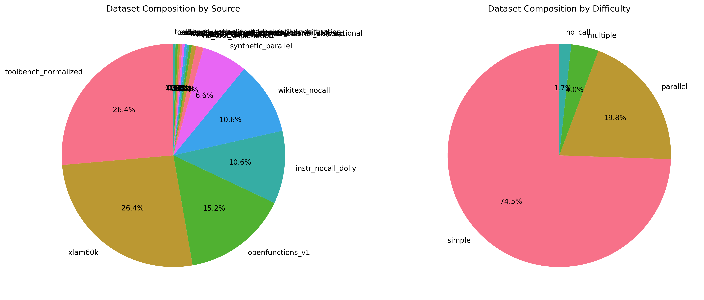
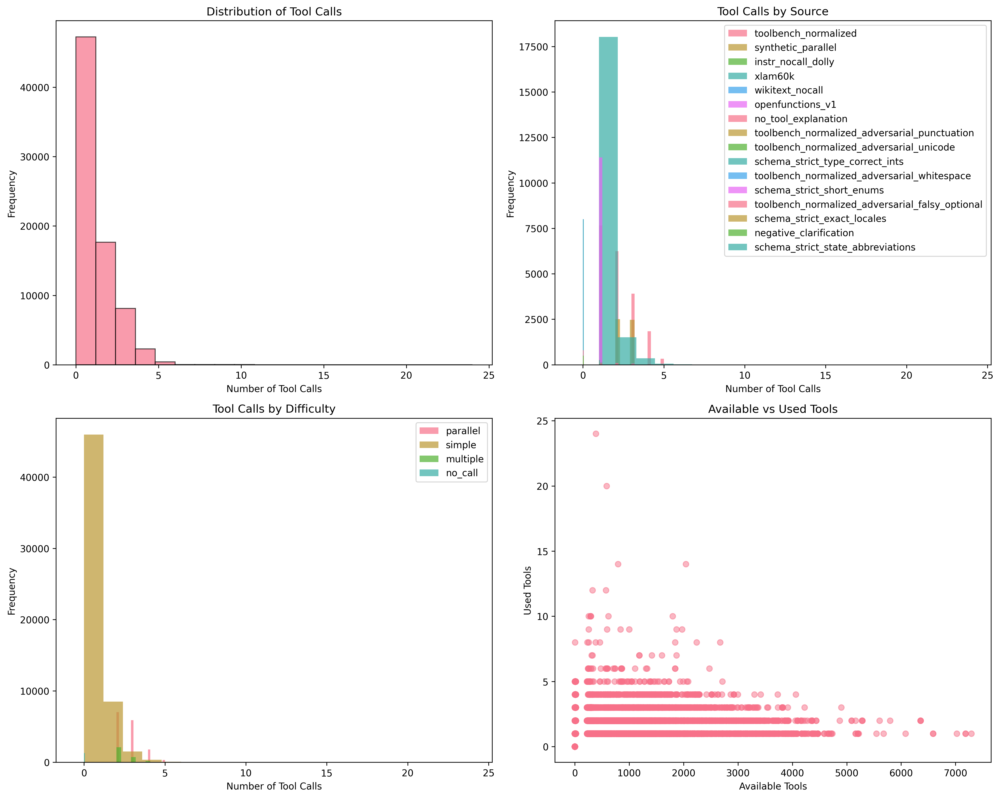
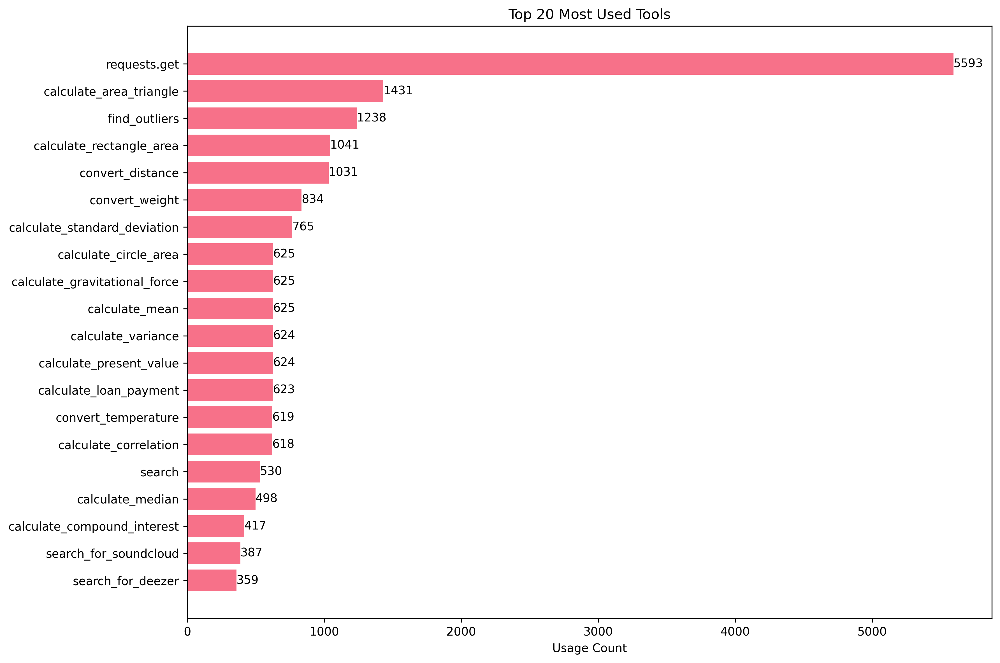

This is a dataset for fine-tuning a language model to use tools. I combined sources from various other tool calling datasets and added some non-tool calling examples to prevent catastrophic forgetting.

## Dataset Overview

### Motivation

This dataset was created to address the need for a diverse, high-quality dataset for training language models in tool usage. By combining multiple sources and including non-tool examples, it aims to produce models that can effectively use tools while maintaining general language capabilities.

### Composition

The dataset combines examples from several high-quality sources:

| Source | Count | Cap | License | URL/Commit |
|--------|-------|-----|----------|------------|
| xLAM | 20,000 | 20k | Apache-2.0 | [xlam-function-calling-60k](https://huggingface.co/datasets/Salesforce/xlam-function-calling-60k) |
| OpenFunctions | 11,538 | 12k | Apache-2.0 | [Gorilla OpenFunctions v1](https://huggingface.co/datasets/gorilla-llm/openfunction-v1) |
| Dolly-15k | 4,000 | 4k | CC BY-SA 3.0 | [databricks-dolly-15k](https://huggingface.co/datasets/databricks/databricks-dolly-15k) |
| WikiText-103 | 4,000 | 4k | CC BY-SA 3.0 | [wikitext-103-raw-v1](https://huggingface.co/datasets/wikitext) |

Key statistics:

- No-call examples: 20.2%
- Difficulty distribution: 99.6% simple / 0.4% multiple
- Total examples: 39,538

### Pre-processing

1. All examples are converted to a unified schema
2. JSON fields are validated and normalized
3. Tool calls are extracted and standardized
4. Random seed 42 is used for all shuffling/sampling

### Intended Use

This dataset is designed for:

- Training language models to use tools effectively
- Fine-tuning existing models for tool usage
- Studying tool calling patterns and behaviors

### Known Limitations & Ethical Risks

1. Limited diversity in tool types and domains
2. Potential biases from source datasets
3. May not cover all edge cases in tool usage
4. Could enable misuse if not properly constrained

## Usage

### Load and Validate Dataset

```python
from datasets import load_dataset
import json

# Load the dataset (primary method)
ds = load_dataset("younissk/tool-calling-mix")

# Alternative method if the above fails (explicit file specification)
# ds = load_dataset(
#     "json",
#     data_files={
#         "train": "hf://datasets/younissk/tool-calling-mix/raw/train.jsonl.gz",
#         "validation": "hf://datasets/younissk/tool-calling-mix/raw/dev.jsonl.gz", 
#         "test": "hf://datasets/younissk/tool-calling-mix/raw/test.jsonl.gz",
#     }
# )

# Helper function to validate JSON fields
def validate_example(example):
    # Parse JSON fields
    tools = json.loads(example["tools_json"])
    messages = json.loads(example["messages_json"])
    target = json.loads(example["target_json"])
    
    # Basic validation
    assert isinstance(tools, list), "tools_json must be a list"
    assert isinstance(messages, list), "messages_json must be a list"
    assert "tool_calls" in target, "target_json must have tool_calls"
    assert isinstance(target["tool_calls"], list), "tool_calls must be a list"
    
    # Validate message format
    for msg in messages:
        assert "role" in msg and "content" in msg, "Invalid message format"
        assert msg["role"] in ["user", "assistant"], "Invalid role"
        assert isinstance(msg["content"], str), "Content must be string"
    
    return True

# Validate a few examples
for split in ds.keys():
    print(f"\nValidating {split} split...")
    for i, example in enumerate(ds[split].select(range(min(5, len(ds[split])))), 1):
        try:
            validate_example(example)
            print(f"✓ Example {i} valid")
        except Exception as e:
            print(f"✗ Example {i} invalid: {str(e)}")
```

### Training Example

```python
from transformers import AutoTokenizer, AutoModelForCausalLM
from datasets import load_dataset
import json

# Load model and tokenizer
model_name = "your-base-model"
tokenizer = AutoTokenizer.from_pretrained(model_name)
model = AutoModelForCausalLM.from_pretrained(model_name)

# Load and prepare dataset
ds = load_dataset("younissk/tool-calling-mix")

def prepare_example(example):
    # Parse JSON fields
    tools = json.loads(example["tools_json"])
    messages = json.loads(example["messages_json"])
    target = json.loads(example["target_json"])
    
    # Format conversation
    conversation = []
    for msg in messages:
        conversation.append(f"{msg['role']}: {msg['content']}")
    
    # Add tool calls if any
    if target["tool_calls"]:
        tool_calls = json.dumps(target["tool_calls"], indent=2)
        conversation.append(f"assistant: Let me help with that.\n{tool_calls}")
    
    # Join with newlines
    return {"text": "\n".join(conversation)}

# Prepare training data
train_data = ds["train"].map(prepare_example)

# Your training loop here...
```

## Quick Start

### Create and Save Dataset

```bash
# Create the mixed dataset with Hub-compatible schema
make run

# Install dependencies first (if needed)
make install

# Development setup: install deps and run
make dev
```

### Upload to Hugging Face Hub

```bash
# Upload dataset to Hugging Face Hub
make upload
```

### Available Make Commands

```bash
# Show all available targets
make help

# Run the main script using uv
make run

# Install dependencies using uv sync
make install

# Development setup: install deps and run
make dev

# Clean up cache and temporary files
make clean

# Upload dataset to Hugging Face Hub
make upload

# Generate data visualizations
make visualize
```

## Dataset Analysis

The dataset has been analyzed to understand its composition, characteristics, and patterns. You can generate these visualizations yourself using:

```bash
make visualize
```

The visualizations are generated using matplotlib and seaborn, providing high-quality static images perfect for documentation and analysis.

### Dataset Composition



The pie charts above show the distribution of examples across different data sources and difficulty levels. Key insights:

- **xLAM dataset dominates** with 50.6% of examples (20,000 samples)
- **OpenFunctions contributes** 29.2% (11,538 samples)
- **No-call examples** from Dolly and WikiText make up 20.2% (8,000 samples)
- **99.6% are simple difficulty** examples, with only 0.4% being multiple tool calls

### Tool Call Analysis



This comprehensive analysis reveals:

- **Most examples use 1 tool call** (average 1.14, max 24)
- **Source-specific patterns**: xLAM and OpenFunctions show different tool call distributions
- **Difficulty correlation**: Multiple difficulty examples tend to have more tool calls
- **Tool efficiency**: Most examples use fewer tools than available

### Message Analysis


Message characteristics analysis shows:

- **Message length distribution** is right-skewed with most messages being concise
- **Weak correlation** between message length and number of tool calls
- **Source differences**: xLAM messages tend to be longer than OpenFunctions
- **Difficulty patterns**: Multiple difficulty examples have more varied message lengths

### Tool Usage Patterns



The horizontal bar chart shows the **top 20 most frequently used tools** in the dataset. This helps identify:

- **Most common APIs** and functions
- **Tool popularity distribution**
- **Potential training focus areas** for specific tool types

## Dataset Statistics

- **Total Examples**: 39,538
- **Valid Examples**: 39,538 (100% valid)
- **Average Tool Calls**: 1.14 per example
- **Maximum Tool Calls**: 24 in a single example
- **Source Balance**: Well-distributed across 4 major sources
- **Difficulty Distribution**: 99.6% simple, 0.4% multiple tool calls

### Features

- **Automatic Schema Fix**: Ensures Parquet-compatible data types for Hugging Face Hub
- **JSONL Backup**: Creates compressed JSONL files for future-proofing
- **Hub Integration**: Direct upload to Hugging Face Hub with proper error handling
- **No Internal Columns**: Automatically removes problematic `_format_kwargs` and similar columns

## Upstream Sources

I adapted and unified examples from the following sources. Please cite them if you use this dataset:

- Zhang, J. et al. (2024). xLAM: A Family of Large Action Models to Empower AI Agents. arXiv:2409.03215.
  Dataset: Salesforce/xlam-function-calling-60k (HF).
  (If using the parsed variant: minpeter/xlam-function-calling-60k-parsed, HF.)

- Patil, S. G., Zhang, T., Wang, X., Gonzalez, J. E. (2024). Gorilla: Large Language Model Connected with Massive APIs.
  NeurIPS 2024. Project: <https://gorilla.cs.berkeley.edu> (OpenFunctions).

- Databricks (2023). databricks-dolly-15k (HF). License: CC BY-SA 3.0.

- Merity, S., Xiong, C., Bradbury, J., Socher, R. (2016). Pointer Sentinel Mixture Models. arXiv:1609.07843.
  Dataset: Salesforce/wikitext – subset `wikitext-103-raw-v1` (HF). License: CC BY-SA.
